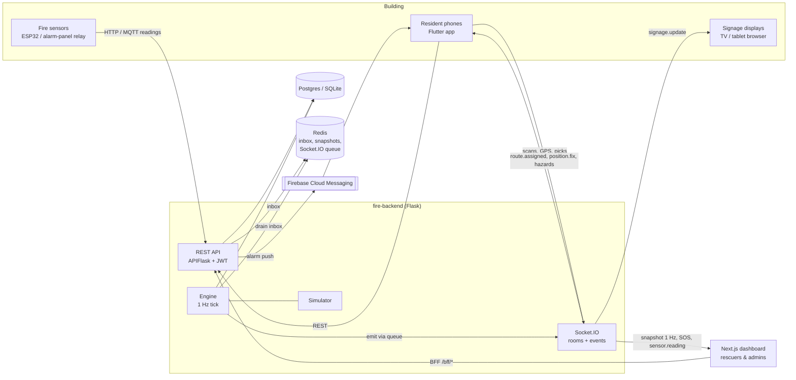
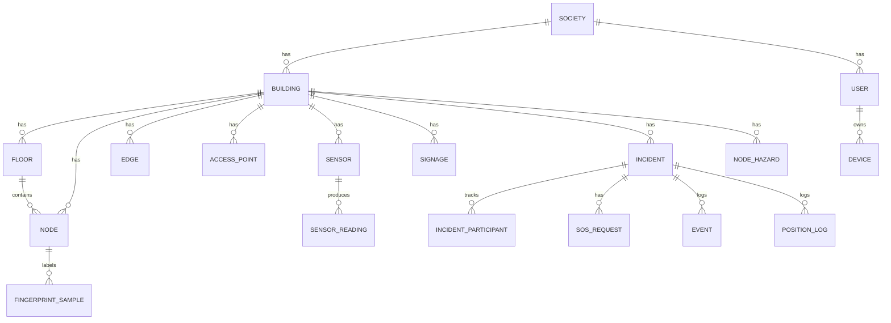
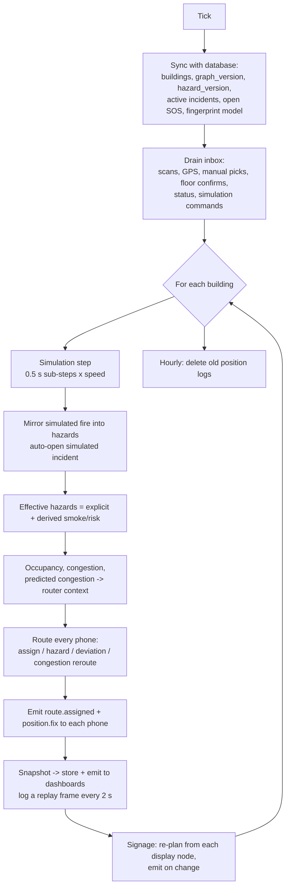
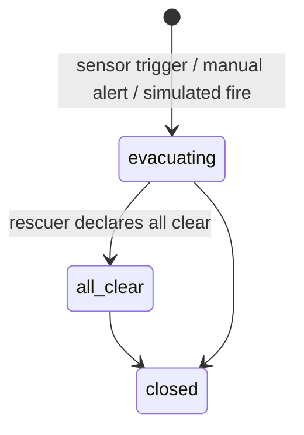

# Deep dive: AI-Driven Smart Fire Evacuation System

This document is the technical reference for the whole system. It covers:
- **architecture**, the **data model** and the **algorithms**, with the paper's equations;
- the **engine loop**, the **realtime contract**, the **dashboard** and the **mobile app**;
- **security and privacy**, **testing** and **evaluation**;
- the system's known limitations.

For a quick start, see [README.md](README.md). For the reproducible Table I results, see [fire-backend/EVALUATION.md](fire-backend/EVALUATION.md).

> **Not a certified life-safety system.** It adds to, and does not replace, fire alarms, fire exits and trained responders.

---

## Contents

1. [Goals and how they map to the paper](#1-goals-and-how-they-map-to-the-paper)
2. [System architecture](#2-system-architecture)
3. [Repository layout](#3-repository-layout)
4. [Data model](#4-data-model)
5. [The building graph](#5-the-building-graph)
6. [Indoor positioning](#6-indoor-positioning)
7. [Evacuation routing](#7-evacuation-routing)
8. [Congestion and prediction](#8-congestion-and-prediction)
9. [Fire detection, sensors and hazards](#9-fire-detection-sensors-and-hazards)
10. [The engine loop](#10-the-engine-loop)
11. [Realtime contract (Socket.IO)](#11-realtime-contract-socketio)
12. [REST API](#12-rest-api)
13. [Incidents, SOS, metrics and replay](#13-incidents-sos-metrics-and-replay)
14. [Simulation and benchmark](#14-simulation-and-benchmark)
15. [Dashboard architecture](#15-dashboard-architecture)
16. [Mobile app architecture](#16-mobile-app-architecture)
17. [Security and privacy](#17-security-and-privacy)
18. [Testing](#18-testing)
19. [Configuration reference](#19-configuration-reference)
20. [Deployment](#20-deployment)
21. [Limitations and future work](#21-limitations-and-future-work)
22. [Paper-to-code traceability](#22-paper-to-code-traceability)

---

## 1. Goals and how they map to the paper

The paper (ICSCC 2025, DOI [10.1109/ICSCC66177.2025.11233739](https://doi.org/10.1109/ICSCC66177.2025.11233739)) sets five objectives. This implementation addresses each one as follows.

| Paper objective | How it is met |
|---|---|
| Real-time evacuation that adapts to fire and congestion | An engine runs every second. It re-plans routes when hazards change or when a route becomes congested, with safeguards against people being bounced between routes (§7.5). |
| Indoor positioning with Wi-Fi (and Bluetooth) **without extra hardware** | Wi-Fi RSSI from residents' phones is fed into eq. 1–5, weighted triangulation (Alg. 3), learned fingerprinting and a particle filter (Alg. 1). Bluetooth beacons were left out by choice: positioning is Wi-Fi only on Android. |
| A\* pathfinding that avoids hazards and reroutes around congestion | Multi-goal A\* (Alg. 2) with an admissible heuristic that works across floors, hazard pruning, congestion and exit-load costs (§7). |
| A central dashboard for responders | The Next.js command dashboard reproduces Fig. 3 and Fig. 4 and adds SOS, an editor, replay and simulation (§15). |
| Shorter evacuation times | Measured in simulation against a static plan. On the 150-person tower it gives 14% faster average evacuation and 47% less exit queueing (§14). |

The paper also describes things beyond the five objectives. These are implemented too:
- digital signage (§III-E);
- multi-floor, level-aware routing (§VI-A);
- an edge/offline fallback (§VI), handled on the phone;
- WebSocket publish/subscribe (§VI);
- post-incident logging (§IV-4).

**Additions beyond the paper:**
- learned Wi-Fi fingerprinting;
- predictive congestion (the paper's Table II "short-term" future work);
- a GPS and manual-pick fallback chain;
- refuge routing for residents who can't use stairs;
- SOS / "I'm safe" with an unaccounted-residents list;
- a reproducible benchmark.

---

## 2. System architecture



**Design choices:**
- **One modular backend, not microservices.** One codebase and one container image with four entry points:
  - `api`: REST and Socket.IO;
  - `engine`: the tick loop;
  - `mqtt-ingest`: the optional sensor bridge;
  - the simulator, which runs inside the engine.
- **Two run modes.**
  - *Local:* `ENGINE_INPROCESS=1` with no Redis. The engine runs as a thread inside the API process, and live state lives in memory.
  - *Docker Compose:* the engine is a separate process. The API and engine exchange live state through Redis, and the engine emits Socket.IO events through Flask-SocketIO's Redis message queue.
- **Concurrency model.** Socket.IO runs in `async_mode="threading"` (real WebSockets via `simple-websocket`) under gunicorn `-w 1 --threads 100`. gevent was avoided on purpose: the engine does numpy and scikit-learn work and uses psycopg, and cooperative green threads would stall every socket during CPU-heavy work.
- **Algorithms are plain Python.** `BuildingGraph`, A\* and the particle filter take dataclasses, not database rows. Tests, the benchmark and the engine all share them.
- **Shared contracts.** `fire-backend/contracts/` holds the OpenAPI spec (51 paths), JSON Schemas for every server→client event, and fixture buildings plus route test vectors. The dashboard and the app are tested against them.

---

## 3. Repository layout

```
fire-backend/                 Flask + Flask-SocketIO server
  app/
    auth/                     JWT, roles, join code, approval queue
    buildings/                graph persistence, editor publish, floor plans
    positioning/              rssi (eq.1-5), trilateration (Alg.3), fingerprint, particle_filter (Alg.1), fallback
    routing/                  graph, astar (Alg.2), planner (cost model), steps, cache
    congestion/               density, predictive model
    engine/                   tick loop, router (assignment + rerouting), runtime state
    simulation/               occupants, fire spread, synthetic RSSI, benchmark
    sensors/                  detection rules, HTTP ingest, MQTT bridge, hazards
    incidents/                lifecycle, participants, SOS, event log, metrics
    realtime/                 Socket.IO handlers, emitter, event schemas
    signage/                  digital signage
  contracts/                  openapi.json, events.schema.json, fixtures (demo buildings, route cases)
  scripts/                    seed, fixtures, contracts export, route cases, model training
  migrations/                 Alembic
  tests/                      pytest (37 tests)
dashboard-final/              Next.js 16 (App Router, TypeScript, Tailwind v4)
  app/(app)/                  authenticated pages
  app/bff/[...path]/          backend-for-frontend proxy
  app/session/                login / logout / socket token
  app/signage/[token]/        kiosk display
  components/, features/, lib/
MainProjectFlutter/           Flutter (Android) resident app
  lib/core/                   api (dio), socket, storage, native bridge, theme
  lib/state/                  session + evacuation controllers (Riverpod)
  lib/services/               notifications (FCM + full-screen), Wi-Fi scanning
  lib/shared/                 graph, offline A* + triangulation, models
  lib/features/               onboarding, permissions, home, alarm, navigation, survey, dev, settings
docs/screenshots/             images used in the README
```

---

## 4. Data model



| Table | Purpose / key fields |
|---|---|
| `societies` | `name`, `join_code` (what residents enter in the app) |
| `users` | `role` (resident / surveyor / rescuer / society_admin), `status` (pending / approved / rejected), `building_id`, `flat`, `home_node_id`, **`stairs_ok`**, `mobility_notes` |
| `devices` | One row per app install. The `id` is a UUID that the app reuses across logins. Also stores `fcm_token` and `last_seen`. |
| `buildings` | `mode` (live / simulation), `floor_height_m`, **`graph_version`** (bumped on every edit), **`hazard_version`** (bumped on every hazard change), `footprint` (lat/lng polygon used for GPS), `settings` (JSON, §19) |
| `floors` | `level`, `width_m`, `height_m`, `plan_image`, `scale_px_per_m` |
| `nodes` | `key`, `type` (room / corridor / stair / lift / exit / refuge / assembly), `x`, `y` (metres on the floor), `capacity`, `exit_flow_per_min`, `lat`/`lng` (exits and assembly points) |
| `edges` | `a`, `b`, `kind` (door / corridor / stair / lift / outdoor), `length_m`, `width_m`, `accessible` |
| `access_points` | `bssid`, `x`, `y`, `floor_id`, **`p_ref`**, **`eta`** (eq. 1 parameters), `calibrated` |
| `fingerprint_samples` | Labelled survey scans: `node_id` plus `readings` as `{bssid: rssi}` |
| `sensors` / `sensor_readings` | Sensor type, node, hashed API key, `triggered`; readings time series (`smoke`, `temperature_c`, `flame`, `alarm`) |
| `node_hazards` | Explicit hazards: `level` plus `source` (sensor / manual / simulation) |
| `incidents` | `kind` (fire / drill), `status`, `is_simulation`, `trigger`, `metrics` (JSON, computed at all-clear) |
| `incident_participants` | Per device: `status` (unknown / evacuating / safe / needs_help), notified/acknowledged/safe timestamps, `assigned_exit_id` |
| `sos_requests` | `kind` (help / trapped / medical), note, last known node/x/y/level, resolved by and when |
| `events` | Append-only log: `type` plus JSON `payload`. Drives replay and metrics. |
| `position_logs` | Resident positions during incidents, kept for `POSITION_RETENTION_DAYS` |

All timestamps go through a `UTCDateTime` column type, which returns timezone-aware UTC on every database. SQLite would otherwise drop the offset, and the dashboard would show times shifted by the local offset (+5:30 in India).

---

## 5. The building graph

The paper models the building as a graph: rooms and intersections are nodes, passageways are edges (§III-C). Coordinates are in **metres on each floor's plan**. The `level` (from the floor) gives the third dimension, `z = level × floor_height_m`.

- **Node types:**
  - `room` and `corridor`: the places people are;
  - `stair` and `lift`: vertical connections, joined across floors by `stair` / `lift` edges;
  - `exit`: the routing goals, with a rated flow in people per minute;
  - `refuge`: a protected waiting area for people who can't use stairs;
  - `assembly`: an outdoor gathering point, used by the GPS "you are safe" check.
- **Edge length.** The effective length is `max(given length_m, straight-line 3-D distance, 0.1 m)`, so no edge is shorter than the straight line between its ends. This guarantee keeps A\* correct (§7.1).
- **Validation** (`routing/graph.py::validate_graph`, run on every editor publish). Publishing is refused if:
  - there are no exits;
  - a floor isn't connected to any other floor by stairs or a lift;
  - a node can't reach any exit.
- **Versioning.** Publishing bumps `graph_version`. The engine rebuilds its in-memory graph, particle-filter map and router, and phones re-download the graph for offline use.

The demo society (`scripts/make_fixtures.py`) has two buildings:
- **Block A (villa):** the paper's own single-floor house, with Entrance, Verandah, Living Room, Kitchen and so on, and exits Entrance, Balcony1 and Balcony2.
- **Block B (tower):** four storeys. Each floor has west, central and east corridors, two staircases and a lift lobby. Upper floors have flats and a refuge area. The ground floor has a lobby, clubhouse and security cabin, and three exits: Main Entrance (60/min), West Fire Exit (40/min) and East Fire Exit (40/min).

---

## 6. Indoor positioning

### 6.1 Inputs from the phone

During an incident, drill or simulation, the app sends Wi-Fi scans as `[{bssid, rssi}]` over Socket.IO. It falls back to REST if the socket is down.

Android allows a foreground app only **4 active scans per 2 minutes**. The app works within that limit:
- it requests a scan every 4 s, and accepted requests go through;
- it also listens for **passive results**, i.e. scans triggered by the system or other apps.

On demo phones, turning off *Developer options → Wi-Fi scan throttling* gives a scan every 3 s or so.

### 6.2 RSSI to distance (paper eq. 1 / 3) and bounds (eq. 4 / 5)

$$d_{est} = d_{ref}\cdot 10^{\frac{-(P_{received}-P_{ref})}{10\eta}}$$

$$d_{min} = d_{ref}\cdot 10^{\frac{-(P_{received}-P_{ref}+u)}{10\eta}}\qquad d_{max} = d_{ref}\cdot 10^{\frac{-(P_{received}-P_{ref}-u)}{10\eta}}$$

In these equations:
- $d_{ref}$ = 1 m;
- $P_{ref}$ and $\eta$ are per access point, with defaults of −40 dBm and 2.7;
- $u$ is `rssi_uncertainty_db`, 6 dB by default.

The code is in `positioning/rssi.py`.

**Calibration.** The dashboard's "Calibrate" action fits $P_{ref}$ and $\eta$ for each router by least squares on survey data, using the linear form $rssi = P_{ref} - 10\eta\log_{10} d$. It uses only same-floor samples, needs at least 3 samples spanning at least 1.5× in distance, and clamps $\eta$ to [1.5, 5].

### 6.3 Weighted triangulation (paper Alg. 3)

The code is in `positioning/trilateration.py`.

1. Take the strongest 6 known routers.
2. Choose the floor by a weighted vote, with weight $1/\max(d,0.5)^2$.
3. On that floor, compute the weighted average of router coordinates with the same weights.

The phone runs a Dart port of this for offline mode.

### 6.4 Learned fingerprinting (addition to the paper)

The code is in `positioning/fingerprint.py`.

- **Training data.** Survey mode records labelled scans at known nodes; about 20 per node is the recommended amount.
- **Model.** A distance-weighted **k-nearest-neighbours** classifier (k = 5) maps a scan vector to a probability per node. Routers missing from a scan count as −100 dBm.
- **Why it matters.** It needs no router positions, so it still works in a housing society where most routers are residents' own.
- **Accuracy.** "Calibrate" reports stratified k-fold cross-validated accuracy and mean position error.

### 6.5 Particle filter (paper Alg. 1)

The code is in `positioning/particle_filter.py`. The filter keeps 400 particles per device, set by the `particles` setting. **Each particle lives on the walkable graph**, as an edge index plus a fraction along that edge, so position estimates never fall inside walls.

1. **Initialise:** spread particles across all edges in proportion to edge length (Alg. 1 line 1).
2. **Predict:** each particle walks $U(0, 1.4\,m/s)\cdot\Delta t$ along its edge and picks a random next edge at a junction. In addition, 3% of particles are re-randomised so the filter recovers if the person is lost ("kidnapped").
3. **Weight** (Alg. 1 line 3). The weight is the product of two likelihoods:
   - **Trilateration term**, over the strongest 8 known routers.
     - First, compensate for floor slabs: $P_{adj} = P_{received} + 15\,dB \times |\Delta\text{floors}|$ (the `floor_attenuation_db` setting).
     - Then apply eq. 4/5 to get $[d_{min}, d_{max}]$, and compare it with the particle's 3-D distance to the router.
     - The error is the distance outside that interval, giving $\log w \mathrel{+}= -\tfrac12(err/1.5\,m)^2$.
   - **Fingerprint term:** $\log w \mathrel{+}= \log(0.05 + p_{kNN}(\text{nearest node}))$.
4. **Normalise** the weights. **Resample** systematically when the effective sample size drops below $N/2$.
5. **Estimate:** pick the floor with the most particle weight, then take the weighted mean of the particles on that floor (Alg. 1 line 7). The node is chosen by a weighted vote. Confidence = $\text{floor\_conf}\times e^{-\text{spread}/6}$.

The floor-attenuation step is what makes multi-floor positioning work. Without it, on synthetic data, the filter put the user on the correct floor only **27%** of the time. With it, **100%** (§14).

### 6.6 Fallback chain and privacy

The code is in `positioning/fallback.py`, and the order is:

1. **Wi-Fi particle filter.** The fix counts as fresh if the last usable scan was at most 45 s ago.
2. **Manual "Where are you?" pick** (block → floor → room). This is a strong observation: it re-seeds the particle filter at that node and **overrides other sources for 60 s**. A manual pick also clears any GPS "outside" verdict, because the person just told us where they are.
3. **GPS / location manager.** Only used for block-level decisions:
   - **Outside the footprint?** It counts as outside only when the accuracy circle is clear of the footprint edge.
   - **Near an assembly point?** Within 40 m, or within the GPS accuracy radius if that is larger.

   GPS never sets a room or a floor.
4. **Last known position**, with confidence halved and a flag asking the user to pick.

The server asks the phone to show the picker when the source is unknown or last-known, or when Wi-Fi confidence is below 0.35. It asks for **floor confirmation** when floor confidence is below 0.6, with at most one prompt every 2 minutes.

**Privacy rule:** the engine ignores position input unless an incident is open or the building is in simulation mode. When an incident ends, every phone's position state is wiped. `position_logs` older than `POSITION_RETENTION_DAYS` are deleted hourly.

---

## 7. Evacuation routing

### 7.1 A\* (paper Alg. 2 / eq. 2)

The code is in `routing/astar.py`. The search is **multi-goal**: every usable exit is a goal. The heuristic is

$$h(n) = \min_{g\in goals}\ \max\big(\ \lVert n_{xy}-g_{xy}\rVert,\ \ |\Delta level|\cdot L_{v}^{min}\ \big)$$

where $L_v^{min}$ is the shortest stair/lift length per floor in the building.

**Why this heuristic never overestimates:**
- every edge is at least as long as the straight line between its ends, so any path is at least as long as its horizontal displacement;
- every floor change uses a vertical edge of at least $L_v^{min}$ per level;
- the larger of two lower bounds is still a lower bound;
- all cost multipliers are ≥ 1, so a path's cost is at least its length.

So A\* returns optimal routes. The tests check this against Dijkstra **from every node** of both demo buildings, and also under hazard, congestion and exit-load costs.

### 7.2 Cost model

The code is in `routing/planner.py`.

$$cost(u\to v) = len(u,v)\cdot\big(1 + \alpha\cdot hazard(v) + \beta\cdot \min(cong(v),3)\big) + \gamma\cdot exitwait(v)$$

| Term | Meaning | Default |
|---|---|---|
| $hazard(v)$ | none 0, **risk 0.25**, **smoke 1.0**; **fire = pruned** (the node is blocked, Alg. 2 line 6) | α = 4 |
| $cong(v)$ | max(current, predicted) occupancy ÷ capacity | β = 2 |
| $exitwait(v)$ | Only on exit nodes: (people already assigned ÷ exit flow per min) × 60 s × 1.2 m/s, so queue time is converted into equivalent walking metres | γ = 1 |

**Pruning rules:**
- Fire nodes are excluded, but the start node is allowed, so people standing in the fire are still routed out.
- **Lifts are excluded during an incident.**
- For residents with `stairs_ok = false`, stair edges and non-accessible edges are excluded. They are routed to an exit if one can be reached step-free, and otherwise to the nearest **refuge**, which rescuers see in the dashboard.

### 7.3 Exit balancing

Each person's `exitwait` term counts everyone else already assigned to that exit, excluding the person themselves. So as an exit fills up, routing to the next exit becomes cheaper. This is what produces the 47% exit-queue reduction in the benchmark.

### 7.4 Route cache

The code is in `routing/cache.py`, following the paper's §VI caching. The cache is an LRU of 4096 routes, keyed by:
- start node;
- `stairs_ok`;
- the person's current exit;
- `hazard_version`;
- a fingerprint of congestion ratios, quantised to 0.25;
- exit loads, bucketed per 5 people;
- whether an incident is active.

A route is only reused while every condition that produced it is unchanged.

### 7.5 Rerouting rules (anti-oscillation)

The code is in `engine/router.py`.

| Situation | Action | Reason code |
|---|---|---|
| First assignment | Plan a route | `initial` |
| The person is no longer on their route | Re-plan immediately | `deviation` |
| The remaining route crosses fire, or the exit is lost | Re-plan immediately | `hazard` |
| A node on the remaining route is at or above the congestion threshold (0.8) | Consider re-planning. Accept only if the new route is **at least 15% cheaper** and the person's **10 s cooldown** has passed. | `congestion` |

The paper only says routes are recomputed when congestion passes a threshold. Without the improvement margin and the cooldown, everyone gets sent to route B, B jams, and everyone is sent back to A.

### 7.6 Step-by-step guidance and signage

- **Instructions** (`routing/steps.py`) are built from the path as landmark steps: "Leave Flat 302", "Go through Floor 3 West Corridor", "Take West Staircase down to Ground Floor", "Exit the building through West Fire Exit".
  - A run of stair edges collapses into one step.
  - Very short corridor steps are merged.
- **Signage** (engine). Each display plans from the node it is mounted at. It shows an arrow toward the next node (0° is plan-north, measured clockwise), an up/down hint when the next step changes floor, the target exit and distance, and the hazard status of every exit.

---

## 8. Congestion and prediction

**Density** (`congestion/density.py`):
- Occupancy is the number of people per node, counting both real phones and simulated occupants.
- A node is congested when occupancy ÷ capacity ≥ `congestion_threshold`.
- The dashboard KPI "congestion rate" is the share of walkable nodes that are congested.

**Predictive congestion** (`congestion/predict.py`, which addresses the paper's Table II):
- **Target:** each node's occupancy **30 s ahead**.
- **Features:** current occupancy, capacity, occupancy ratio, neighbours' occupancy, the number of remaining routes passing through the node, the number of people whose *next* node it is, whether it is an exit or a stair, and time since the incident started.
- **Model:** a `HistGradientBoostingRegressor` trained on simulator runs (`scripts/train_congestion.py`), evaluated on **held-out scenarios**.
- **Fallback:** without a trained model, the system uses the baseline "current occupancy + ½ × planned arrivals".

| 30 s-ahead forecast | Mean absolute error (people per node) |
|---|---|
| Gradient-boosted model | **0.34** |
| Persistence baseline | 1.39 |
| Planned-inflow baseline | 1.74 |

The model forecasts about 4× better than the baselines, **but routing with it did not measurably change evacuation outcomes** (±1.5%, within seed noise). Exit balancing already uses planned assignments, which carry most of the signal. This is reported as a negative result; see [EVALUATION.md](fire-backend/EVALUATION.md).

---

## 9. Fire detection, sensors and hazards

**Detection rules** (`sensors/detection.py`). Any one of these marks the sensor's node as on fire:
- smoke ≥ `smoke_threshold` (300);
- temperature ≥ `temp_threshold_c` (57 °C, the usual rating of fixed-temperature heat detectors);
- a temperature rise ≥ `rate_of_rise_c_per_min` (8 °C/min), measured against a reading 20–120 s old;
- a flame sensor reporting true;
- an **alarm-panel dry contact** reporting `alarm: true`. This is the realistic way to integrate an *existing* fire alarm panel.

**Ingest:**
- **HTTP:** `POST /api/sensors/{id}/readings` with an `X-Sensor-Key` header. Keys are stored as SHA-256 hashes and compared in constant time.
- **MQTT** (optional, the Docker Compose `mqtt` profile): topic `sensors/{id}/reading`, JSON payload including `key`.

When a sensor triggers:
1. the node's hazard is set to `fire`, with source `sensor`;
2. an incident opens, if none is active;
3. residents are alerted by socket and FCM push;
4. `sensor.reading` goes out to dashboards.

A sensor reading normal again does **not** clear the hazard automatically: a rescuer confirms.

**Hazard derivation** (`sensors/hazards.py`):
- Only *explicit* hazards are stored.
- **Smoke** (nodes next to fire) and **risk** (one step further) are derived when needed, so they always follow the fire. They never spread across outdoor edges.
- Precedence: a sensor or manual hazard outranks a simulated one, and severity order is fire > smoke > risk.

---

## 10. The engine loop

The code is in `app/engine/engine.py`. The loop runs once per second (`ENGINE_TICK_SECONDS`). It follows the paper's system flow (§IV: data collection, processing, path planning, output).



**Timings:**

| Item | Interval |
|---|---|
| Replay frame (`snapshot` event in the log) | every 2 s during an incident |
| Position log for each phone | every 5 s during an incident |
| Fingerprint model refresh check | every 30 s, or immediately on "retrain" |
| Device metadata cache | 60 s |
| Simulation summary event | every 10 s |

**Route-update latency.** For hazard reroutes, the engine records `now − hazard_changed_at`, i.e. from the moment the hazard was stored to when the route was emitted. Post-incident metrics report the average and p95 of these.

---

## 11. Realtime contract (Socket.IO)

**Connecting:**
- Phones and dashboards connect with `auth: {token: <JWT>}`.
- Signage displays connect with `auth: {signage_token}`.
- The origin check allows the configured dashboard origins, plus same-origin connections from native clients. Tokens travel in the auth payload, not cookies, so this is safe.

**Rooms:**

| Room | Who joins |
|---|---|
| `device:<id>` | that phone (joined automatically) |
| `residents:<building>` | every resident phone of the building (automatic) |
| `building:<id>` | staff, after emitting `subscribe {building_id}` |
| `signage:<id>` | that display |

**Client → server:**

| Event | Payload | Notes |
|---|---|---|
| `scan` | `{readings: [{bssid, rssi}]}` | Ignored unless an incident is open or the building is in simulation mode |
| `gps` | `{lat, lng, accuracy_m}` | |
| `manual_location` | `{node_id}` | "Where are you?" result |
| `floor_confirm` | `{level}` | |
| `subscribe` / `unsubscribe` | `{building_id}` | Staff only. The ack carries the latest snapshot. |

**Server → client** (schemas in `contracts/events.schema.json`; every payload has a `ts` in epoch ms):

| Event | To | Content |
|---|---|---|
| `snapshot` | building | KPIs, hazards, occupancy, congestion and predicted congestion, exits, devices (real and simulated) with routes, unaccounted residents, open SOS, simulation state. Sent every second. |
| `incident.updated` | building, residents | incident info |
| `hazards` | residents | effective hazard map and `hazard_version`, for the phone map and offline routing |
| `route.assigned` | device | path, nodes, steps, goal and goal type, remaining metres, reason, version, latency |
| `route.none` / `route.cleared` | device | no safe route, or route no longer needed |
| `position.fix` | device | source, x/y/level/node, confidence, floor confidence, spread, outside, near_assembly, needs_picker, confirm_floor |
| `signage.update` | signage | status, message, arrow_deg, vertical hint, exit, distance, exits |
| `sensor.reading`, `sos.created`, `sos.resolved`, `participant.updated` | building | |

**Stale-data policy.** The dashboard treats data as **stale** when the socket is down or no snapshot has arrived for 5 s. It shows a banner and greys out the map. An empty map must never read as "all clear".

---

## 12. REST API

The full spec is in `contracts/openapi.json`, with Swagger UI at `/docs`. All routes are under `/api`.

| Area | Endpoints |
|---|---|
| Accounts | `GET /join/{code}`, `POST /auth/register`, `POST /auth/login` (with `device` for apps), `POST /auth/refresh` (rotating), `POST /auth/logout`, `GET /auth/me`, `POST /devices/fcm` |
| Admin | `GET /residents?status=`, `POST /residents/{id}/approve`, `/reject`, `PATCH /residents/{id}`, `POST /staff` |
| Buildings | `GET/POST /buildings`, `GET/PATCH/DELETE /buildings/{id}` (mode, settings, footprint), `GET/PUT /buildings/{id}/graph`, `POST /buildings/{id}/graph/validate`, `POST /floors/{id}/plan`, `GET /buildings/{id}/live` |
| Positioning | `POST /positioning/scan`, `/gps`, `/manual`, `/floor-confirm`, `GET /positioning/me` |
| Survey | `POST /buildings/{id}/survey`, `GET /survey/coverage`, `DELETE /survey/{node}`, `POST /access-points/register`, `POST /survey/calibrate` |
| Sensors and hazards | `GET/POST /buildings/{id}/sensors`, `POST /sensors/{id}/readings` (sensor key), `POST /sensors/{id}/rotate-key`, `GET /sensors/{id}/readings`, `GET/POST/DELETE /buildings/{id}/hazards` |
| Incidents | `POST/GET /buildings/{id}/incidents`, `GET /incidents/{id}`, `POST /incidents/{id}/status`, `GET /incidents/{id}/events`, `GET /incidents/{id}/export.csv` |
| Residents in an incident | `GET /me/incident`, `POST /me/acknowledge`, `POST /me/status`, `POST /sos`, `GET /buildings/{id}/sos`, `POST /sos/{id}/resolve` |
| Simulation | `POST /buildings/{id}/simulation` (start / spawn / ignite / extinguish / pause / resume / speed / spread / alarm / reset / stop), `POST /buildings/{id}/benchmark`, `GET /benchmark/{job}` |
| Signage | `GET/POST /buildings/{id}/signage`, `DELETE /signage/{id}`, `GET /signage/display/{token}` |

---

## 13. Incidents, SOS, metrics and replay



- **Opening an incident:**
  - a participant row is created for every approved resident device of the building;
  - every resident is alerted by socket and FCM push;
  - each phone opens the full-screen alarm.
- **Resident status** goes unknown → evacuating (on acknowledge) → safe or needs_help. SOS records the last known position. The dashboard lists everyone *not yet safe*, including residents who can't use stairs.
- **Metrics,** computed at all-clear:
  - duration;
  - counts by status;
  - average and maximum evacuation time;
  - average alert-to-acknowledge time;
  - number of route assignments and reroutes by reason;
  - average and p95 route-update latency;
  - the latest simulation summary.
- **Replay:**
  - the event log stores a compact frame every 2 s (KPIs, hazards, exit loads, and each device's position and status) plus discrete events;
  - the dashboard plays the frames on a timeline;
  - CSV export contains every non-frame event.

---

## 14. Simulation and benchmark

**Simulator** (`simulation/world.py`, `fire.py`, `rssi_synth.py`):
- **Occupants:**
  - spawned in rooms and corridors in proportion to capacity;
  - walking speed N(1.25, 0.25) m/s, clipped to 0.5–1.8;
  - 5% have mobility needs and move at 0.6× speed;
  - reaction time is 0–20 s after the alarm.
- **Movement:** speed factor = clip(1 − 0.55·max(0, ratio − 0.5), 0.15, 1). Stairs multiply speed by 0.6, and smoke by 0.7.
- **Exits:** process people at their rated flow, so queues form.
- **Trapped:** anyone on a burning node for 20 s counts as trapped.
- **Fire spread:** spreads along edges as a Poisson process at `spread_per_min`.
  - Doors spread at 0.6× that rate.
  - Stairs spread at 0.8× going up and 0.2× going down (fire climbs stair cores).
  - Fire never spreads across outdoor edges.
- **Virtual phones:** a share of occupants send synthetic scans, generated with:
  - the log-distance path-loss model;
  - 4 dB of noise;
  - 15 dB of loss per floor;
  - −92 dBm receiver sensitivity.

  These go through the **real** particle filter, which gives live localization-error numbers.
- **Routing:** simulated occupants are routed by the **same `EvacRouter`** that serves real phones.

**Benchmark** (`simulation/benchmark.py`, and the button in the dashboard):
- For each seed, the **static plan** and the **dynamic A\*** see identical occupants, reaction times and fire spread, because the fire uses a separate random stream.
- The static plan means walking to the nearest exit by distance, and re-planning only when you physically run into fire.

20-seed results on the tower (150 people, fire in flat 102):

| Metric | Static plan | Proposed (dynamic A\*) | Change |
|---|---|---|---|
| Average evacuation time | 55.6 s | 47.8 s | −14% |
| 90th percentile | 104.1 s | 78.7 s | −24% |
| Total evacuation time | 126.3 s | 105.3 s | −17% |
| Average exit queue | 10.3 | 5.5 | −47% |
| Trapped by fire | 1.15 | 0.80 | −30% |
| Re-routing 200 people | N/A | about 11 ms | |
| Localization error, fused (median / p90) | | 1.95 m / 5.0 m | synthetic |
| Localization error, trilateration only / fingerprint only (median) | | 6.7 m / 2.6 m | synthetic |
| Correct floor | | 100% | synthetic |

**How these compare with the paper's Table I:**
- **Evacuation time:** the paper claims −29%, from 450 s to 320 s. We measured −14% on the average and −24% on the 90th percentile. Our buildings are smaller, and the gain grows with crowd size.
- **Exit queueing:** the paper claims a 35% reduction; we measured 47% on the tower.
- **Route-update latency:** the paper reports about 2.1 s. Ours is dominated by the 1 s engine tick plus the network.
- **Localization:** the paper claims 3–5 m. Our synthetic result is optimistic. With real phones and throttled scans, expect room-level accuracy of roughly 4–8 m.

---

## 15. Dashboard architecture

- **Stack:**
  - Next.js 16 (App Router) with TypeScript, Tailwind v4 and shadcn-style components (Radix);
  - TanStack Query, zustand, zod, Recharts and socket.io-client;
  - maps drawn as SVG in metre coordinates (`components/floor-map.tsx`).
- **Auth:**
  - `/session/login` exchanges credentials with Flask and stores the access and refresh JWTs in **httpOnly cookies** (marked `secure` when `COOKIE_SECURE=1`);
  - `proxy.ts` (Next 16's middleware) redirects to `/login` when there is no session cookie;
  - real authorisation happens in Flask.
- **BFF:** every REST call goes to `/bff/*`, a route handler that attaches the token, retries once after refreshing, and passes through CSV and multipart uploads. Browser code never sees the refresh token.
- **Realtime:**
  - there is one shared socket, with a token fetched from `/session/token` **on every reconnect**;
  - snapshots are validated with zod, and malformed payloads are dropped and counted;
  - `useBuildingSubscription` re-subscribes after reconnects.
- **Pages:**
  - **live command**: KPIs, floor map, SOS, exit capacity, not-yet-safe list, device table, and a hazard dialog for rescuers;
  - **simulation** and **benchmark**;
  - **floor-plan editor**: place, connect, move and add routers; floors and plan images; JSON import/export; validate, publish and calibrate;
  - **incidents and replay**;
  - **sensors**, **signage**, **settings** and **residents**;
  - the public **signage display** page.

---

## 16. Mobile app architecture

- **Stack:**
  - Flutter 3.44 / Dart 3.12, Android only. Kotlin DSL Gradle, AGP 9, Java 17, core library desugaring.
  - Riverpod 3, go_router, dio, socket_io_client, wifi_scan, geolocator, firebase_messaging, flutter_local_notifications, mobile_scanner and flutter_secure_storage.
- **State:**
  - `SessionController` handles the server address, login (with a persistent device UUID), signup, the approval state and FCM token registration.
  - `EvacuationController` handles the socket, incident state, hazards, fix, route, scan loop, GPS fallback, offline mode and queued actions.
  - The evacuation controller rebuilds only when session status, building or mode change.
- **Socket.** Each connection uses `forceNew`. socket_io_client caches one connection manager per URL, and after a dispose the cached manager is dead, which used to leave the app offline after a re-login.
- **Alarm:**
  - FCM *data* messages are turned into a local notification on an **alarm channel**: importance max, bypasses Do Not Disturb, alarm audio, `fullScreenIntent`;
  - `MainActivity` is marked `showWhenLocked` / `turnScreenOn`;
  - the alarm screen vibrates and keeps the screen on through a small Kotlin bridge;
  - without Firebase configured, alarms still arrive over the socket while the app is open.
- **Location fallback:**
  - after 45 s without usable Wi-Fi, or when the server asks for it, the app opens the "Where are you?" sheet, pre-selecting the last known room;
  - GPS uses Android's plain location manager, so no Google Play "Location Accuracy" dialog can pop up mid-evacuation, and it backs off for 60 s after errors.
- **Offline mode:**
  - after 10 s without the server, the phone routes by itself using the cached graph and hazards, Dart A\* and triangulation;
  - status updates and SOS are queued and replayed when the connection returns;
  - parity tests prove the Dart A\* gives **exactly** the server's paths and costs.
- **Screens:**
  - onboarding: server, login, join (code or QR), signup, pending approval;
  - permissions wizard, including Android 14 full-screen-intent handling and a warning to allow autostart on Xiaomi, Oppo, Vivo and Realme phones;
  - home, alarm and evacuation (map, next step, step list, I'm safe / Need help, long-press for 112, large text);
  - survey mode, the simulation dev panel, and settings, including a local alarm test.

---

## 17. Security and privacy

- **Passwords and keys:**
  - passwords are hashed with scrypt (Werkzeug);
  - sensor keys and signage tokens are high-entropy random strings, and sensor keys are stored as SHA-256 hashes.
- **Tokens:**
  - JWT access tokens last 60 min by default;
  - refresh tokens last 30 days and **rotate on use**; logout revokes them.
- **Role checks** on every route:
  - residents can't approve, edit or see other buildings;
  - staff can only reach buildings in their own society.
- **Privacy by design:**
  - positions are processed only during an incident, drill or simulation;
  - phone position state is wiped at all-clear;
  - position history is deleted after N days;
  - the app explains every permission it asks for.
- **Before any public deployment:**
  - set a long random `JWT_SECRET`;
  - don't seed the demo accounts (their password is published in the README);
  - set `CORS_ORIGINS`, use HTTPS and set `COOKIE_SECURE=1`;
  - sign the APK with your own keystore.

---

## 18. Testing

| Suite | Count | Highlights |
|---|---|---|
| Backend `pytest` | 37 | A\* = Dijkstra from every node; admissible heuristic; Fig. 3 paths; lifts and refuge rules; eq. 1/4/5; path-loss fit; particle filter converges (median < 3 m, correct floor); fingerprint cross-validation; manual pick beats GPS-outside; simulator; API flows end to end (sensor → incident → route → SOS → metrics, simulation mode, graph publish, survey calibration); **real engine output validated against the event schemas** |
| Dashboard `vitest` | 6 | stale-data rules, snapshot validation, field parity with the backend contract |
| App `flutter test` | 16 | offline A\* equals the server routes for 10 shared cases (paths and costs to 1e-6); eq. 1; triangulation; payload parsing; stair collapsing; step-free routing |

The commands are:
- Backend: `pytest` (in `fire-backend`).
- Dashboard: `npm test && npm run typecheck && npm run lint && npm run build`.
- App: `flutter test && flutter analyze`.

---

## 19. Configuration reference

**Environment variables** (backend):

| Variable | Default | Purpose |
|---|---|---|
| `DATABASE_URL` | `sqlite:///fire.db` | Postgres in Docker: `postgresql+psycopg://…` |
| `REDIS_URL` | empty | Empty means in-memory live state (single process) |
| `ENGINE_INPROCESS` | `1` | Run the engine as a thread inside the API process |
| `JWT_SECRET` | dev value | **Must change** for any deployment |
| `CORS_ORIGINS` | `http://localhost:3000` | Comma-separated dashboard origins |
| `FIREBASE_CREDENTIALS` | empty | Service-account JSON path; enables push |
| `MQTT_HOST`, `MQTT_PORT` | empty, 1883 | Optional sensor broker |
| `POSITION_RETENTION_DAYS` | 7 | Privacy retention for position history |
| `ENGINE_TICK_SECONDS` | 1.0 | Engine loop period |

**Per-building settings** (dashboard → Settings, stored in `buildings.settings`):

| Key | Default | Meaning |
|---|---|---|
| `alpha`, `beta`, `gamma` | 4, 2, 1 | Cost weights for hazard, congestion and exit wait (§7.2) |
| `congestion_threshold` | 0.8 | Occupancy ÷ capacity that counts as congested |
| `reroute_improvement` | 0.15 | Minimum gain before a congestion reroute is accepted |
| `reroute_cooldown_s` | 10 | Minimum seconds between congestion reroutes for one person |
| `rssi_uncertainty_db` | 6 | $u$ in eq. 4/5 |
| `floor_attenuation_db` | 15 | Signal loss per floor slab |
| `particles` | 400 | Particles per phone |
| `low_confidence` | 0.35 | Below this, ask "Where are you?" |
| `floor_confirm_confidence` | 0.6 | Below this, ask to confirm the floor |
| `smoke_threshold`, `temp_threshold_c`, `rate_of_rise_c_per_min` | 300, 57, 8 | Detection rules |

**Dashboard:**
- `NEXT_PUBLIC_API_URL`: the API address the browser uses.
- `API_URL`: the server-side address, e.g. `http://api:5000` in Docker.
- `COOKIE_SECURE`: set to `1` to mark cookies secure.

**App:** `--dart-define=API_URL=…` pre-fills the server address.

---

## 20. Deployment

- **Local** (as in the README):
  - backend: `python run.py`;
  - dashboard: `npm run dev`;
  - phones join the laptop's Wi-Fi and use `http://<laptop-IP>:5000`.
- **Docker Compose** (`fire-backend/docker-compose.yml`) runs:
  - Postgres;
  - Redis;
  - a one-off Alembic migration;
  - the API (gunicorn, 1 worker, 100 threads);
  - a separate engine process;
  - the dashboard (Next.js standalone build);
  - optionally Mosquitto and the MQTT bridge (`--profile mqtt`).
- **Free hosting options:**

  | Option | Notes |
  |---|---|
  | Laptop + Cloudflare quick tunnel | Best for demos. |
  | Oracle Cloud Always Free VM | Runs the whole Compose stack, always on. |
  | Render + Neon + Vercel | Free web services sleep after 15 min, so it's only suitable for showing the dashboard. |

  A fire-alarm backend shouldn't sleep, so prefer an always-on host.

---

## 21. Limitations and future work

**Limitations** (tested honestly):
- Positioning numbers come from synthetic RSSI. Real buildings are noisier, and Android scan throttling limits update rates on ordinary phones.
- Wi-Fi positioning depends on routers having power. Fires often cut power, which is why the GPS / manual / last-known chain and offline routing exist.
- Simulation results come from a graph-based crowd model with a simplified density–speed relation and no individual collision dynamics.
- FCM wake-up on a locked phone wasn't measured, and aggressive OEM battery managers can delay it.
- The predictive congestion model learns from the simulator it is tested in, and gave no measurable routing gain.
- "Edge computing devices" and "backup cloud processing" (paper §VI) are covered only by phone-side offline routing. Hot server failover is not implemented.

**Future work**, mapped to the paper's Table II:
- BLE beacons, UWB or thermal cameras (advanced sensor fusion);
- forecasts over longer horizons, at stair cores, trained on real drill data (predictive congestion);
- an on-site edge node running the same Compose stack (5G / edge);
- real-world drills with residents and the fire department (deployment and testing);
- AR guidance (AR interfaces).

---

## 22. Paper-to-code traceability

| Paper | Implementation |
|---|---|
| §III-B eq. 1, §V-A eq. 3–5 | `fire-backend/app/positioning/rssi.py` |
| §V-B Alg. 1 particle filter | `fire-backend/app/positioning/particle_filter.py` |
| §V-D Alg. 3 triangulation | `fire-backend/app/positioning/trilateration.py`, `MainProjectFlutter/lib/shared/offline_routing.dart` |
| §III-C graph model, eq. 2, §V-C Alg. 2 A\* | `fire-backend/app/routing/graph.py`, `astar.py`, `planner.py`; Dart port in `offline_routing.dart` |
| §III-D congestion and rerouting | `fire-backend/app/congestion/`, `app/engine/router.py` |
| §III-E / §IV-4 communication and output | `app/realtime/`, `app/notifications/fcm.py`, `app/signage/`, the dashboard, the app |
| §IV system flow (modules 1–4) | `app/engine/engine.py` |
| §VI WebSockets, publish/subscribe, caching | Flask-SocketIO rooms and Redis queue; `app/routing/cache.py` |
| §VI fault tolerance / edge | Phone offline A\* and triangulation, queued actions |
| §VI-A multi-floor, lifts excluded | Graph levels, admissible vertical heuristic, lift pruning |
| §VII results / Table I | `app/simulation/benchmark.py`, `EVALUATION.md` |
| Fig. 3 dashboard / Fig. 4 evacuation graph | `dashboard-final/app/(app)/buildings/[id]/page.tsx`, `features/live/*` |
| Fig. 5 app UI | `MainProjectFlutter/lib/features/alarm`, `navigation`, `home` |
| Table II predictive congestion | `app/congestion/predict.py`, `scripts/train_congestion.py` |
