<div align="center">

# 🔥 AI-Driven Smart Fire Evacuation System

**Real-time, personalised escape routes for every resident, plus a live command view for rescuers.**

Indoor Wi-Fi positioning · hazard- and congestion-aware A\* routing · full-screen phone alarms · digital signage · simulation and replay


-02569B?logo=flutter)


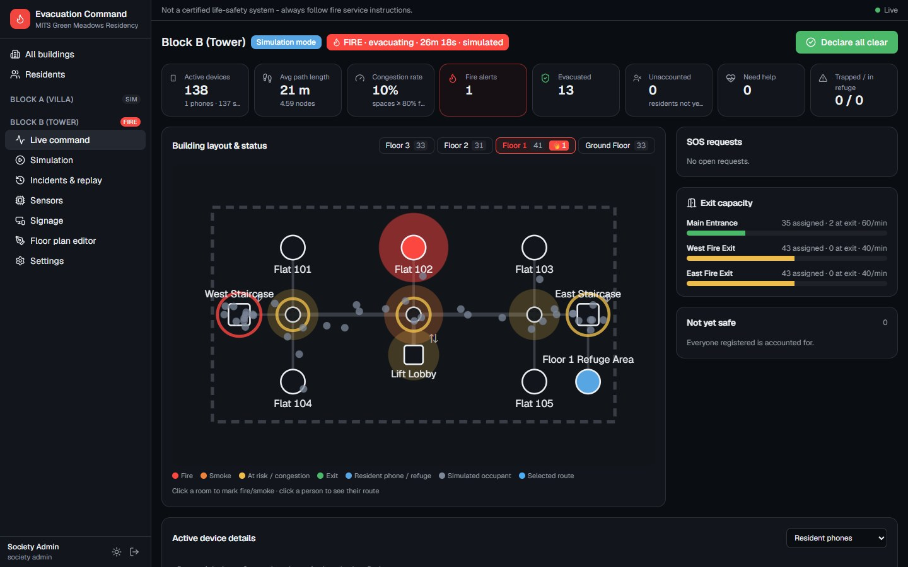

</div>

---

## What it is

In a building fire, printed evacuation plans send everyone to the nearest exit. That can mean a corridor full of smoke, or a single staircase jammed while another stands empty.

This system turns a housing society into a **live evacuation network**:

1. **Detect.** A smoke or heat sensor, an alarm-panel relay, or a rescuer marks a room as on fire. An incident opens and every resident's phone gets a **full-screen alarm**.
2. **Locate.** Each phone reports the Wi-Fi signals it can hear. The server estimates the person's position with **trilateration, learned fingerprinting and a particle filter**. When Wi-Fi isn't usable it falls back to GPS and a simple "Where are you?" picker.
3. **Route.** Every person gets their own route from **A\* search** over the building graph. Burning areas are excluded, smoky and crowded areas are avoided, and people are **spread across exits by capacity**. Lifts are never used, and residents who can't use stairs are sent to a **refuge area**, which rescuers are told about.
4. **Adapt.** Each second the engine checks whether the fire has spread or a route has filled up. If it has, affected phones get a new route with the reason shown.
5. **Command.** Rescuers see everyone's position, the hazards, exit loads, SOS calls and who is still unaccounted for. **Digital signs** in corridors point to the safest exit from where they hang.
6. **Learn.** Every incident is logged for **replay**, metrics and CSV export. A built-in simulator reproduces the paper's static-plan vs dynamic-routing comparison.

This repository is the revamped implementation of our IEEE ICSCC 2025 paper (details under [Paper](#paper)).

> ⚠️ **Not a certified life-safety system.** It adds to, and does not replace, fire alarms, fire exits and the instructions of trained responders.

---

## Screenshots

### Rescuer dashboard

| Live command (villa, kitchen fire) | Simulation console |
|---|---|
| 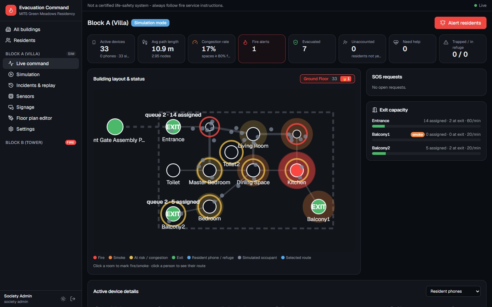 | 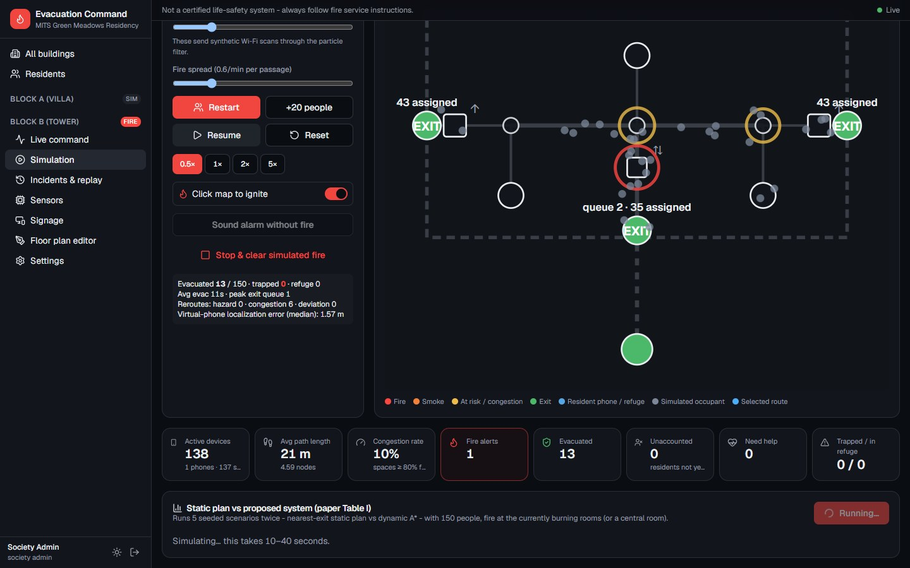 |
| **Static plan vs dynamic routing (paper Table I)** | **Incident replay** |
| 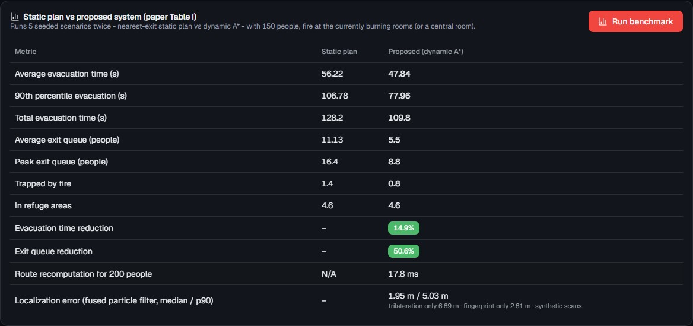 | 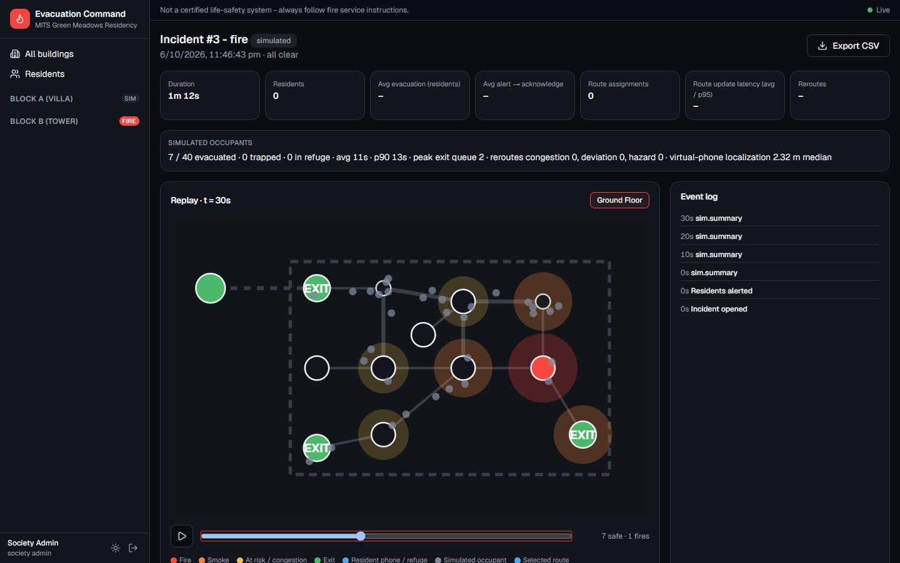 |
| **Floor-plan editor** | **Fire sensors (live readings, alarm)** |
| 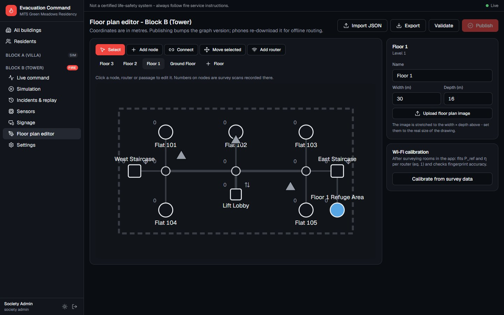 | 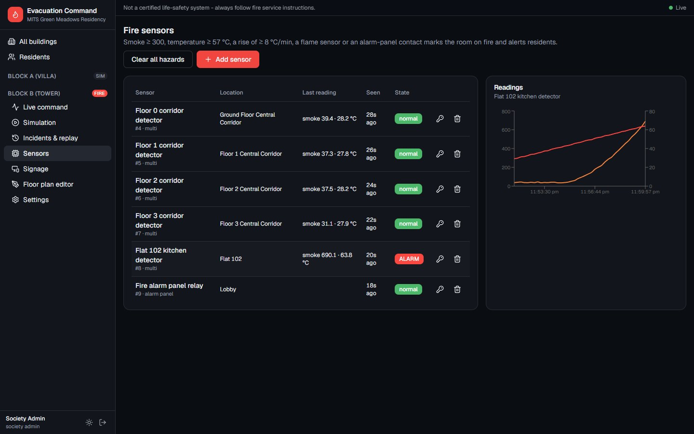 |
| **Society overview** | **Resident approvals** |
| 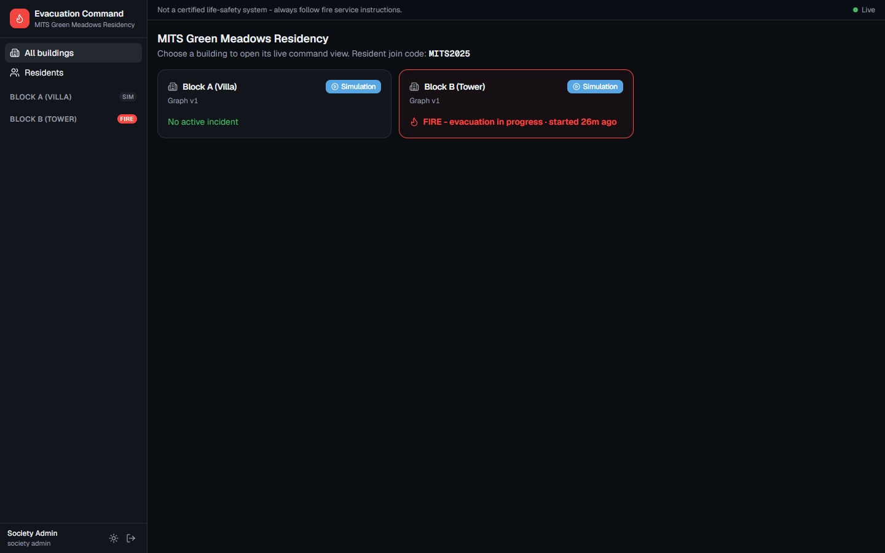 | 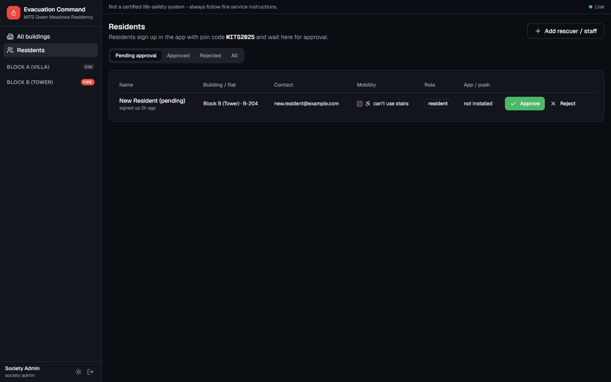 |

### Digital signage

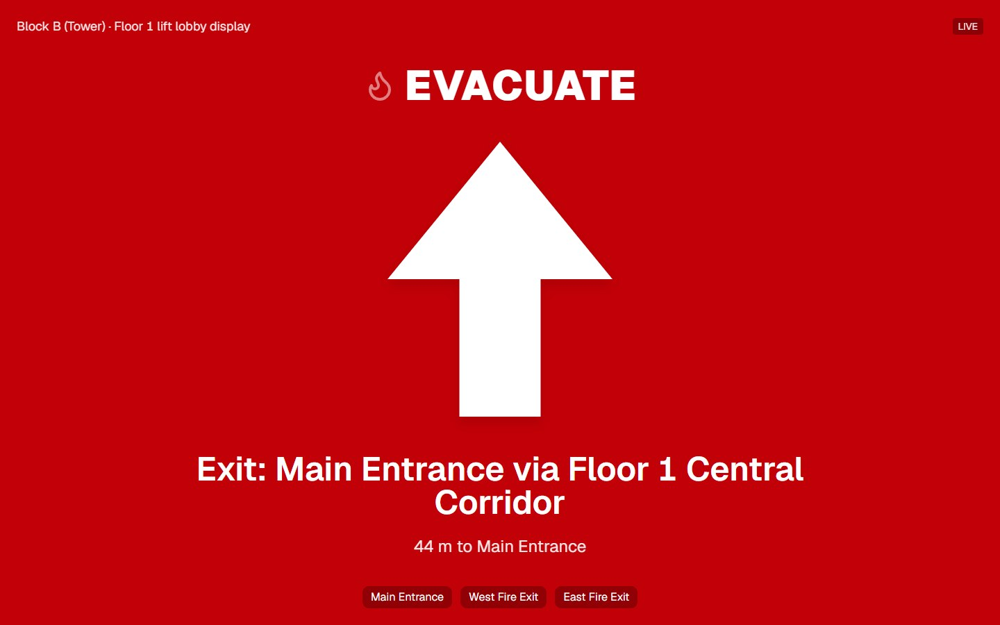

### Resident app (Android)

<table>
  <tr>
    <td align="center">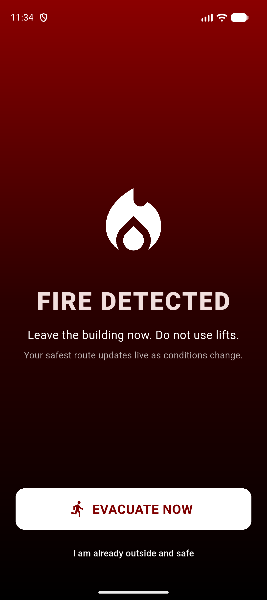<br/><sub>Full-screen alarm</sub></td>
    <td align="center">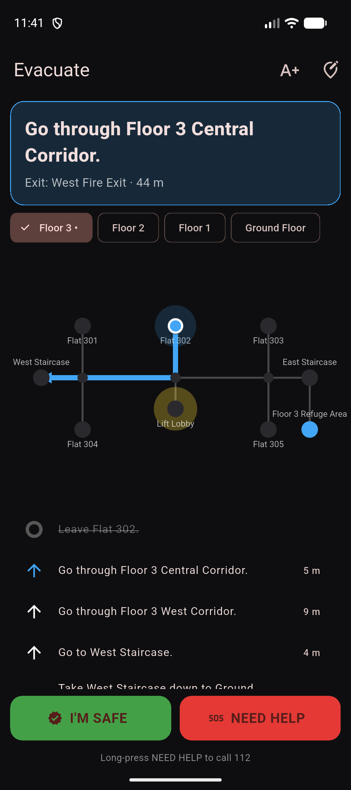<br/><sub>Personal route, step by step</sub></td>
    <td align="center">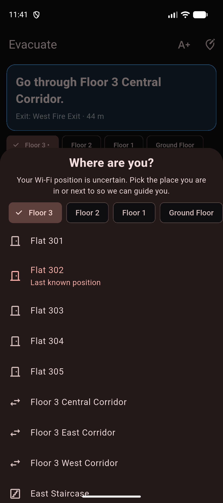<br/><sub>"Where are you?" fallback</sub></td>
    <td align="center">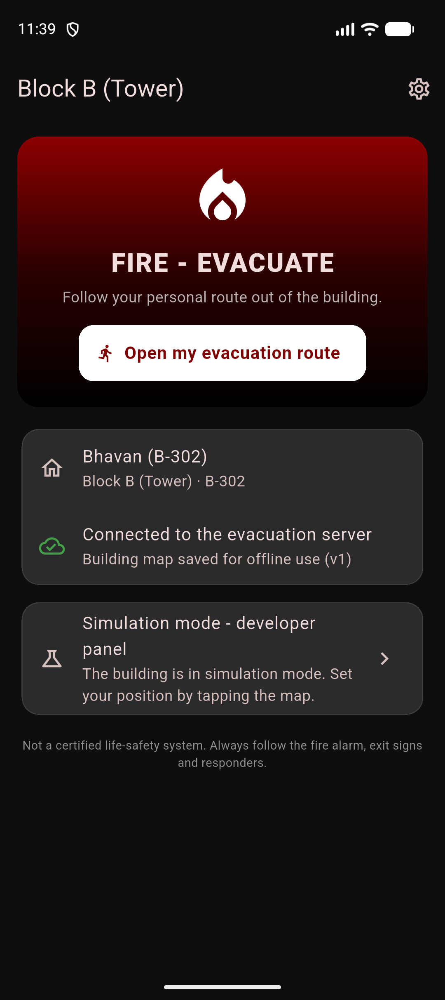<br/><sub>Home during a fire</sub></td>
  </tr>
  <tr>
    <td align="center">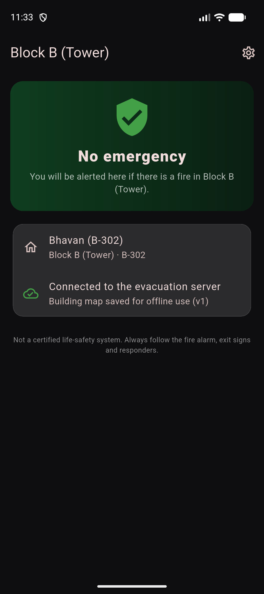<br/><sub>Normal state</sub></td>
    <td align="center">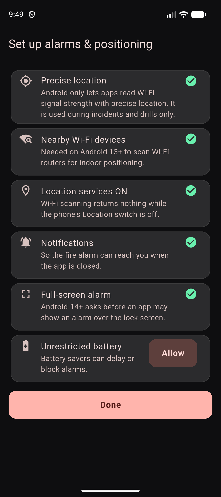<br/><sub>Alarm & positioning setup</sub></td>
    <td align="center">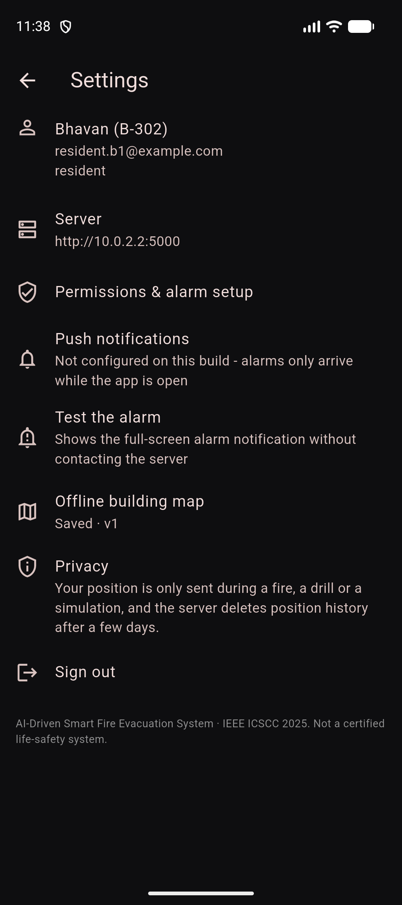<br/><sub>Settings & privacy</sub></td>
    <td align="center">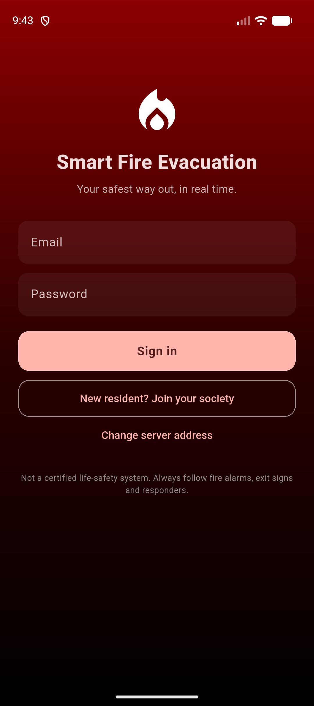<br/><sub>Sign in / join society</sub></td>
  </tr>
</table>

---

## Features

| | |
|---|---|
| 📍 **Indoor positioning** | Wi-Fi RSSI → paper eq. 1–5. Weighted triangulation (Alg. 3) + kNN fingerprinting fused in a **particle filter** (Alg. 1) that compensates for signal loss through floor slabs. Fallbacks: GPS (outside/assembly), then a manual picker, then the last known position. |
| 🧭 **Routing** | Multi-goal **A\*** (Alg. 2) with an admissible multi-floor heuristic. Fire pruned; cost for smoke, crowding and exit queues; lifts excluded; refuge routing for people who can't use stairs. Safeguards stop people being bounced between routes. |
| 🚨 **Alarms** | Firebase push, then a full-screen alarm over the lock screen, then the evacuation screen. Sensor ingest over HTTP or MQTT, including alarm-panel dry contacts. |
| 🖥️ **Command dashboard** | Live KPIs, a floor map with people and hazards, exit capacity, SOS and the unaccounted list, a device table, and click-to-mark hazards. |
| 🪧 **Digital signage** | Browser kiosk pages that point to the safest exit from where each sign is mounted, updating live. |
| 🧪 **Simulation** | Virtual occupants on the same routing engine, fire spread, virtual phones running the real positioning, and a one-click Table I benchmark. |
| 📼 **Post-incident** | Event log, replay timeline, metrics (evacuation time, acknowledge time, route-update latency) and CSV export. |
| 📡 **Offline fallback** | Phones cache the building map and route by themselves if the server is unreachable (on-device A\* identical to the server's). |
| 🔒 **Privacy** | Positions are processed only during an incident, drill or simulation, and history is deleted after N days. |

---

## Architecture

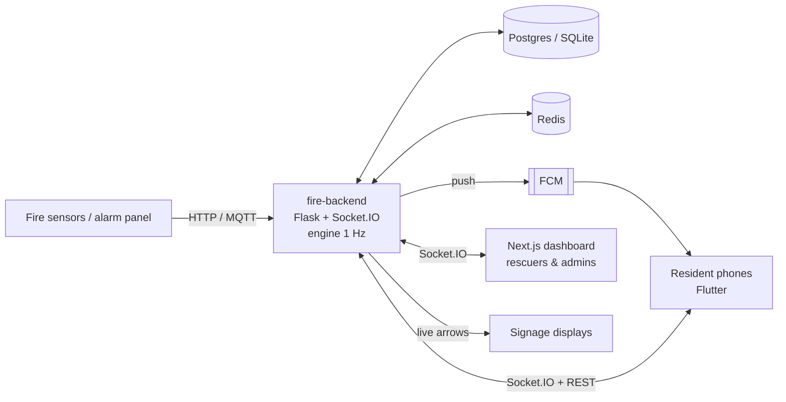

| Folder | Stack | Role |
|---|---|---|
| [`fire-backend/`](fire-backend) | Python 3.12+, APIFlask, Flask-SocketIO, SQLAlchemy, numpy, scikit-learn | Positioning, routing engine, sensors, incidents, simulator, benchmark |
| [`dashboard-final/`](dashboard-final) | Next.js 16, TypeScript, Tailwind v4, TanStack Query, zod | Rescuer and admin command dashboard, signage pages |
| [`MainProjectFlutter/`](MainProjectFlutter) | Flutter 3.44 (Android), Riverpod, socket.io, FCM | Resident app |

📖 **Full technical documentation:** [DEEP_DIVE.md](DEEP_DIVE.md) (algorithms with equations, engine loop, realtime contract, API, data model, security, testing).

---

## Quick start (one laptop, no Docker)

You need Python 3.12+, Node 20+ and Flutter 3.44 with the Android SDK.

**1. Backend**

```bash
cd fire-backend
```

```bash
python -m venv .venv && .venv/Scripts/pip install -r requirements-dev.txt
```

```bash
.venv/Scripts/python -m scripts.seed
```

The seed creates the demo society and prints logins, sensor keys and signage links.

```bash
.venv/Scripts/python run.py
```

This starts the API, Socket.IO and the engine on `0.0.0.0:5000`. API docs are at http://localhost:5000/docs.

**2. Dashboard**

```bash
cd dashboard-final
```

```bash
npm install
```

Create `dashboard-final/.env.local` containing:

```
NEXT_PUBLIC_API_URL=http://localhost:5000
API_URL=http://localhost:5000
```

```bash
npm run dev
```

Open http://localhost:3000.

**3. Phone app**

```bash
cd MainProjectFlutter
```

```bash
flutter build apk --release
```

Install `build/app/outputs/flutter-apk/app-release.apk` on an Android phone **on the same Wi-Fi**, and enter `http://<laptop-LAN-IP>:5000` as the server. Allow port 5000 through the laptop's firewall.

**Docker alternative:** run `docker compose up --build` in `fire-backend/` (Postgres, Redis, API, a separate engine and the dashboard). See [fire-backend/README.md](fire-backend/README.md).

### Demo accounts

These are created by the seed. The password for all of them is `Evacuate@123`, and the society join code is **`MITS2025`**.

| Account | Use |
|---|---|
| `admin@example.com` | Dashboard: society admin (editor, settings, approvals) |
| `rescuer@example.com` | Dashboard: rescuer |
| `resident.b1@example.com` | App: tower resident, flat B-302 |
| `resident.b2@example.com` | App: tower resident who uses a wheelchair (refuge routing) |
| `surveyor@example.com` | App: Wi-Fi survey mode |

### 5-minute demo

1. **Dashboard:** go to **Block A → Simulation**, switch to *Simulation*, press **Start**, then click the **Kitchen**. An incident opens automatically, the crowd moves and exits fill by capacity.
2. **Phone:** log in as `resident.b1`. In the dashboard, go to **Block B → Alert residents → Start a drill**. The phone shows the full-screen alarm; tap **EVACUATE NOW** to get the route.
3. **Reroute:** in the live view, click a corridor on the route and mark it **Fire**. The phone reroutes within about a second, and a banner explains why.
4. **Close out:** tap **I'M SAFE** on the phone, **Declare all clear** in the dashboard, then open **Incidents → Replay**.

---

## Results (simulation, 20 seeds)

4-storey tower, 150 occupants, fire starting in flat 102. Reproduce with `python -m app.simulation.benchmark --seeds 20`.

| Metric | Static evacuation plan | This system (dynamic A\*) |
|---|---|---|
| Average evacuation time | 55.6 s | **47.8 s (−14%)** |
| 90th percentile evacuation time | 104.1 s | **78.7 s (−24%)** |
| Average exit queue | 10.3 people | **5.5 people (−47%)** |
| Trapped by fire | 1.15 | **0.80** |
| Route recomputation for 200 people | N/A | **about 11 ms** |
| Localization error (fused, synthetic Wi-Fi) | – | **1.95 m median / 5.0 m p90** |

Methodology, comparison with the paper's Table I, and limits (including a negative result for predictive congestion) are in [EVALUATION.md](fire-backend/EVALUATION.md).

---

## Testing

| Part | Command | Tests |
|---|---|---|
| Backend | `cd fire-backend && .venv/Scripts/python -m pytest` | 37: A\* matches Dijkstra on every node, paper equations, particle filter convergence, API flows end to end, event contracts |
| Dashboard | `cd dashboard-final && npm test && npm run typecheck && npm run lint` | 6: stale-data rules, payload validation, contract parity |
| App | `cd MainProjectFlutter && flutter test && flutter analyze` | 16: offline A\* gives exactly the server's routes |

---

## Paper

> Bhavan S, Nandhana KP, Ria Stanly Keecheril, Rohit Babu George, Asha Raj, **"AI-Driven Smart Fire Evacuation System"**, *2025 11th International Conference on Smart Computing and Communications (ICSCC)*, IEEE, 2025. DOI: [10.1109/ICSCC66177.2025.11233739](https://doi.org/10.1109/ICSCC66177.2025.11233739)

The PDF is not included because the IEEE copy is licensed. Muthoot Institute of Technology and Science, Kerala, India.
