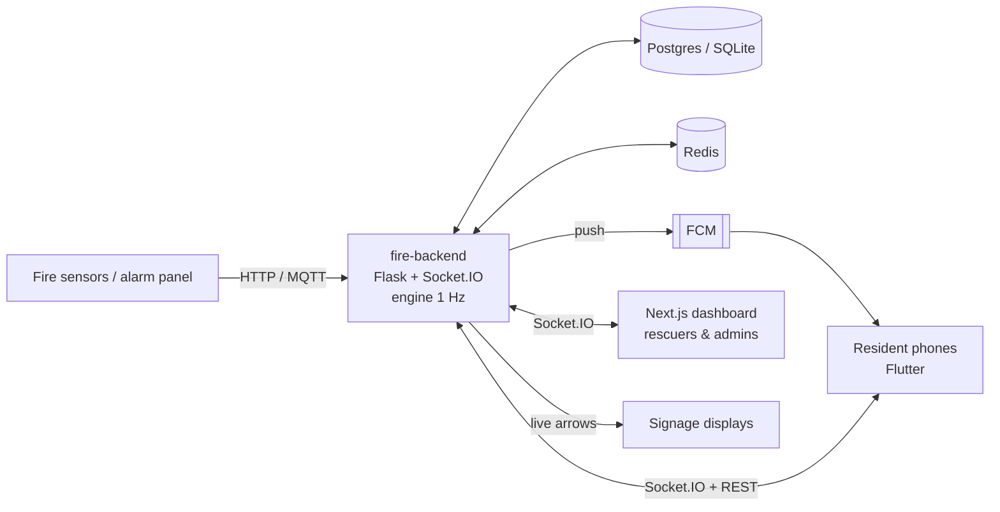

<div align="center">

# 🔥 AI-Driven Smart Fire Evacuation System

**Real-time, personalised escape routes for every resident, plus a live command view for rescuers.**

Official implementation of the IEEE ICSCC 2025 paper
[*"AI-Driven Smart Fire Evacuation System"*](https://doi.org/10.1109/ICSCC66177.2025.11233739)

Indoor Wi-Fi positioning · hazard- and congestion-aware A\* routing · full-screen phone alarms · digital signage · simulation and replay

[](https://doi.org/10.1109/ICSCC66177.2025.11233739)
[](https://doi.org/10.1109/ICSCC66177.2025.11233739)


-02569B?logo=flutter)


</div>

---

## Contents

- [Overview](#overview)
- [How it works](#how-it-works)
- [Screenshots](#screenshots)
- [Features](#features)
- [Architecture](#architecture)
- [Repository layout](#repository-layout)
- [Paper-to-code map](#paper-to-code-map)
- [Quick start](#quick-start)
- [Reproducing the paper's results](#reproducing-the-papers-results)
- [Results](#results)
- [Testing](#testing)
- [Limitations](#limitations)
- [Citation](#citation)
- [Authors and acknowledgements](#authors-and-acknowledgements)

---

## Overview

In a building fire, printed evacuation plans send everyone to the nearest exit. That can mean a corridor full of smoke, or one staircase jammed while another stands empty.

This repository contains the complete, working system described in our paper. It turns a housing society into a **live evacuation network**. Residents' own phones are used for indoor positioning, so no extra hardware is needed. A central server plans a **personal, hazard-aware route for each person** and updates it every second as the fire and the crowd move. Rescuers get a live command view, and corridor displays show the safest direction from where they hang.

The repository has three parts: a Python backend (positioning, routing engine, simulator), a Next.js rescuer dashboard and a Flutter resident app for Android. It also includes the **simulator and benchmark used to compare against a static evacuation plan** (the paper's Table I), so the results below can be reproduced with a single command.

> ⚠️ **Not a certified life-safety system.** This is a research prototype. It adds to, and does not replace, fire alarms, fire exits and the instructions of trained responders.

---

## How it works

1. **Detect.** A smoke or heat sensor, an alarm-panel relay or a rescuer marks a room as on fire. An incident opens, and every resident's phone gets a **full-screen alarm**.
2. **Locate.** Each phone reports the Wi-Fi signals it can hear. The server estimates the person's position with **trilateration, learned fingerprinting and a particle filter**. When Wi-Fi isn't usable it falls back to GPS and then to a simple "Where are you?" picker.
3. **Route.** Every person gets their own route from **A\* search** over the building graph. Burning areas are excluded, smoky and crowded areas are avoided, and people are **spread across exits by capacity**. Lifts are never used. Residents who can't use stairs are sent to a **refuge area**, and rescuers are told where they are.
4. **Adapt.** Every second the engine checks whether the fire has spread or a route has filled up. If so, the affected phones get a new route, with the reason shown.
5. **Command.** Rescuers see everyone's position, the hazards, exit loads, SOS calls and who is still unaccounted for. **Digital signs** in corridors point to the safest exit from where they hang.
6. **Learn.** Every incident is logged for **replay**, metrics and CSV export.

---

## Screenshots

### Rescuer dashboard

| Live command (villa, kitchen fire) | Simulation console |
|---|---|
|  |  |
| **Static plan vs dynamic routing (paper Table I)** | **Incident replay** |
|  |  |
| **Floor-plan editor** | **Fire sensors (live readings, alarm)** |
|  |  |
| **Society overview** | **Resident approvals** |
|  |  |

### Digital signage


### Resident app (Android)

<table>
  <tr>
    <td align="center"><br/><sub>Full-screen alarm</sub></td>
    <td align="center"><br/><sub>Personal route, step by step</sub></td>
    <td align="center"><br/><sub>"Where are you?" fallback</sub></td>
    <td align="center"><br/><sub>Home during a fire</sub></td>
  </tr>
  <tr>
    <td align="center"><br/><sub>Normal state</sub></td>
    <td align="center"><br/><sub>Alarm & positioning setup</sub></td>
    <td align="center"><br/><sub>Settings & privacy</sub></td>
    <td align="center"><br/><sub>Sign in / join society</sub></td>
  </tr>
</table>

---

## Features

| | |
|---|---|
| 📍 **Indoor positioning** | Wi-Fi RSSI → paper eq. 1–5. Weighted triangulation (Alg. 3) and kNN fingerprinting, fused in a **particle filter** (Alg. 1) that compensates for signal loss through floor slabs. Fallbacks: GPS (outside or at the assembly point), then a manual picker, then the last known position. |
| 🧭 **Routing** | Multi-goal **A\*** (Alg. 2) with an admissible multi-floor heuristic. Burning areas are pruned; smoke, crowding and exit queues add cost; lifts are excluded; people who can't use stairs are routed to refuge areas. Safeguards stop people being bounced between routes. |
| 🚨 **Alarms** | Firebase push, then a full-screen alarm over the lock screen, then the evacuation screen. Sensor readings arrive over HTTP or MQTT, including alarm-panel dry contacts. |
| 🖥️ **Command dashboard** | Live KPIs, a floor map with people and hazards, exit capacity, SOS calls and the unaccounted list, a device table, and click-to-mark hazards. |
| 🪧 **Digital signage** | Browser kiosk pages that point to the safest exit from where each sign is mounted, updated live. |
| 🧪 **Simulation** | Virtual occupants on the same routing engine, fire spread, virtual phones running the real positioning code, and a one-click Table I benchmark. |
| 📼 **Post-incident** | Event log, replay timeline, metrics (evacuation time, acknowledge time, route-update latency) and CSV export. |
| 📡 **Offline fallback** | Phones cache the building map and route by themselves if the server can't be reached. The on-device A\* gives the same routes as the server's. |
| 🔒 **Privacy** | Positions are processed only during an incident, drill or simulation, and position history is deleted after a configurable number of days. |

---

## Architecture



| Component | Stack | Role |
|---|---|---|
| [`fire-backend/`](fire-backend) | Python 3.12+, APIFlask, Flask-SocketIO, SQLAlchemy, numpy, scikit-learn | Positioning, routing engine, sensors, incidents, simulator, benchmark |
| [`dashboard-final/`](dashboard-final) | Next.js 16, TypeScript, Tailwind v4, TanStack Query, zod | Rescuer and admin command dashboard, signage pages |
| [`MainProjectFlutter/`](MainProjectFlutter) | Flutter 3.44 (Android), Riverpod, socket.io, FCM | Resident app |

📖 **Full technical documentation:** [DEEP_DIVE.md](DEEP_DIVE.md) covers the algorithms with their equations, the engine loop, the realtime contract, the API, the data model, security and testing.

---

## Repository layout

```
.
├── fire-backend/            Flask + Socket.IO server
│   ├── app/
│   │   ├── positioning/     RSSI model (eq. 1–5), triangulation (Alg. 3), fingerprinting, particle filter (Alg. 1)
│   │   ├── routing/         building graph, A* (Alg. 2), cost model, turn-by-turn steps
│   │   ├── congestion/      crowd density, predictive model
│   │   ├── engine/          1 Hz tick loop, route assignment and rerouting
│   │   ├── simulation/      occupants, fire spread, synthetic Wi-Fi, benchmark
│   │   ├── sensors/         detection rules, HTTP and MQTT ingest, hazards
│   │   ├── incidents/       lifecycle, SOS, event log, metrics, replay
│   │   ├── realtime/        Socket.IO handlers and event schemas
│   │   └── signage/         digital signage
│   ├── contracts/           OpenAPI spec, event schemas, demo buildings, benchmark results
│   ├── tests/               pytest suite
│   └── EVALUATION.md        method and full results
├── dashboard-final/         Next.js rescuer dashboard and signage pages
├── MainProjectFlutter/      Flutter resident app (Android)
├── docs/screenshots/        images used in the documentation
└── DEEP_DIVE.md             technical reference
```

---

## Paper-to-code map

| Paper | Implementation |
|---|---|
| §III-B eq. 1, §V-A eq. 3–5: RSSI to distance | [`fire-backend/app/positioning/rssi.py`](fire-backend/app/positioning/rssi.py) |
| §V-B Alg. 1: particle filter | [`fire-backend/app/positioning/particle_filter.py`](fire-backend/app/positioning/particle_filter.py) |
| §V-D Alg. 3: weighted triangulation | [`fire-backend/app/positioning/trilateration.py`](fire-backend/app/positioning/trilateration.py) |
| §III-C graph model, eq. 2, §V-C Alg. 2: A\* | [`fire-backend/app/routing/`](fire-backend/app/routing) (`graph.py`, `astar.py`, `planner.py`) |
| §III-D congestion and rerouting | [`fire-backend/app/congestion/`](fire-backend/app/congestion), [`fire-backend/app/engine/router.py`](fire-backend/app/engine/router.py) |
| §III-E / §IV-4 alerts, signage, post-incident log | [`app/realtime/`](fire-backend/app/realtime), [`app/notifications/`](fire-backend/app/notifications), [`app/signage/`](fire-backend/app/signage), [`app/incidents/`](fire-backend/app/incidents) |
| §IV system flow | [`fire-backend/app/engine/engine.py`](fire-backend/app/engine/engine.py) |
| §VI fault tolerance (edge / offline) | [`MainProjectFlutter/lib/shared/offline_routing.dart`](MainProjectFlutter/lib/shared/offline_routing.dart) |
| §VII results, Table I | [`fire-backend/app/simulation/benchmark.py`](fire-backend/app/simulation/benchmark.py), [`EVALUATION.md`](fire-backend/EVALUATION.md) |
| Fig. 3 dashboard, Fig. 4 evacuation graph | [`dashboard-final/app/(app)/buildings/[id]/page.tsx`](<dashboard-final/app/(app)/buildings/[id]/page.tsx>), [`dashboard-final/features/live/`](dashboard-final/features/live) |
| Fig. 5 app UI | [`MainProjectFlutter/lib/features/`](MainProjectFlutter/lib/features) |
| Table II future work: predictive congestion | [`fire-backend/app/congestion/predict.py`](fire-backend/app/congestion/predict.py) |

The complete mapping is in [DEEP_DIVE.md §22](DEEP_DIVE.md#22-paper-to-code-traceability).

---

## Quick start

This runs everything on one laptop without Docker. You need **Python 3.12+**, **Node 20+** and, for the phone app, **Flutter 3.44** with the Android SDK.

### 1. Backend

```bash
cd fire-backend
python -m venv .venv
```

Activate the virtual environment:

```bash
# macOS / Linux
source .venv/bin/activate
# Windows (PowerShell)
.venv\Scripts\Activate.ps1
```

Install the dependencies, create the demo society and start the server:

```bash
pip install -r requirements-dev.txt
python -m scripts.seed
python run.py
```

The seed prints logins, sensor keys and signage links. `run.py` starts the API, Socket.IO and the engine on `0.0.0.0:5000`. Interactive API docs are at http://localhost:5000/docs.

### 2. Dashboard

In a second terminal:

```bash
cd dashboard-final
npm install
```

Create `dashboard-final/.env.local` containing:

```
NEXT_PUBLIC_API_URL=http://localhost:5000
API_URL=http://localhost:5000
```

Then start it and open http://localhost:3000:

```bash
npm run dev
```

### 3. Phone app (optional)

```bash
cd MainProjectFlutter
flutter build apk --release
```

Install `build/app/outputs/flutter-apk/app-release.apk` on an Android phone **on the same Wi-Fi** as the laptop, and enter `http://<laptop-LAN-IP>:5000` as the server. Allow port 5000 through the laptop's firewall. An Android emulator reaches the host at `http://10.0.2.2:5000`.

### Docker alternative

Run `docker compose up --build` in `fire-backend/`. This starts Postgres, Redis, the API, a separate engine process and the dashboard. See [fire-backend/README.md](fire-backend/README.md) for details.

### Demo accounts

The seed creates these accounts. The password for all of them is `Evacuate@123`, and the society join code is **`MITS2025`**.

| Account | Use |
|---|---|
| `admin@example.com` | Dashboard: society admin (editor, settings, approvals) |
| `rescuer@example.com` | Dashboard: rescuer |
| `resident.b1@example.com` | App: tower resident, flat B-302 |
| `resident.b2@example.com` | App: tower resident who uses a wheelchair (refuge routing) |
| `surveyor@example.com` | App: Wi-Fi survey mode |

The demo society has two buildings. **Block A** is the single-floor villa from the paper. **Block B** is a 4-storey tower with two staircases, a lift, refuge areas on each upper floor and three exits.

### 5-minute demo

1. **Simulate.** In the dashboard, go to **Block A → Simulation**, switch to *Simulation*, press **Start**, then click the **Kitchen**. An incident opens automatically, the crowd moves and the exits fill according to capacity.
2. **Alert a phone.** Log in on the phone as `resident.b1`. In the dashboard, go to **Block B → Alert residents → Start a drill**. The phone shows the full-screen alarm; tap **EVACUATE NOW** to see the route.
3. **Reroute.** In the live view, click a corridor on the route and mark it **Fire**. The phone reroutes within about a second, and a banner explains why.
4. **Close out.** Tap **I'M SAFE** on the phone, press **Declare all clear** in the dashboard, then open **Incidents → Replay**.

---

## Reproducing the paper's results

All numbers in [Results](#results) come from the built-in simulator. They are deterministic for a given set of seeds. With the backend's virtual environment active:

```bash
cd fire-backend
python -m app.simulation.benchmark --seeds 20 --json contracts/benchmark_results.json
```

The same benchmark can be run from the dashboard, under **Simulation → Run benchmark**. The committed results are in [`contracts/benchmark_results.json`](fire-backend/contracts/benchmark_results.json). To retrain the predictive congestion model (paper Table II):

```bash
python -m scripts.train_congestion --runs 24
```

The method (crowd model, fire spread, synthetic Wi-Fi, static-plan baseline) is described in [EVALUATION.md](fire-backend/EVALUATION.md).

---

## Results

Simulation, 20 seeds. 4-storey tower, 150 occupants, fire starting in flat 102.

| Metric | Static evacuation plan | This system (dynamic A\*) |
|---|---|---|
| Average evacuation time | 55.6 s | **47.8 s (−14%)** |
| 90th percentile evacuation time | 104.1 s | **78.7 s (−24%)** |
| Total evacuation time | 126.3 s | **105.3 s (−17%)** |
| Average exit queue | 10.3 people | **5.5 people (−47%)** |
| Trapped by fire | 1.15 | **0.80** |
| Route recomputation for 200 people | N/A | **about 11 ms** |
| Localization error (fused, synthetic Wi-Fi) | – | **1.95 m median / 5.0 m p90** |

**Compared with the paper's Table I:** the improvements go in the same direction but are smaller (−14% average evacuation time here, against −29% in the paper), because the demo buildings are smaller and evacuate in about 2 minutes rather than 7. The exit-queue reduction (47%) is larger than the paper's 35%. Localization figures use synthetic Wi-Fi and are optimistic; room-level accuracy of 4–8 m is a more realistic expectation in a real building. [EVALUATION.md](fire-backend/EVALUATION.md) gives the full comparison, the villa results, and a negative result for predictive congestion.

---

## Testing

| Part | Command | Tests |
|---|---|---|
| Backend | `cd fire-backend && python -m pytest` | 37: A\* matches Dijkstra on every node, paper equations, particle filter convergence, end-to-end API flows, event contracts |
| Dashboard | `cd dashboard-final && npm test && npm run typecheck && npm run lint` | 6: stale-data rules, payload validation, contract parity |
| App | `cd MainProjectFlutter && flutter test && flutter analyze` | 16: offline A\* gives exactly the server's routes |

---

## Limitations

- Positioning accuracy is measured on synthetic Wi-Fi signals. Real buildings are noisier, and Android limits how often ordinary phones can scan.
- Wi-Fi positioning needs routers to have power. Fires often cut power, which is why the GPS, manual-pick and offline-routing fallbacks exist.
- Evacuation results come from a graph-based crowd model with a simplified density–speed relation, not from real drills.
- Push wake-up time on a locked phone was not measured and depends on the device's battery manager.

See [DEEP_DIVE.md §21](DEEP_DIVE.md#21-limitations-and-future-work) for the full list and future work.

---

## Citation

If you use this code or build on this work, please cite the paper:

> Bhavan S, Nandhana KP, Ria Stanly Keecheril, Rohit Babu George and Asha Raj, **"AI-Driven Smart Fire Evacuation System"**, in *2025 11th International Conference on Smart Computing and Communications (ICSCC)*, IEEE, 2025. DOI: [10.1109/ICSCC66177.2025.11233739](https://doi.org/10.1109/ICSCC66177.2025.11233739)

```bibtex
@inproceedings{bhavan2025firevac,
  author    = {{Bhavan S} and {Nandhana KP} and {Ria Stanly Keecheril} and {Rohit Babu George} and {Asha Raj}},
  title     = {{AI}-Driven Smart Fire Evacuation System},
  booktitle = {2025 11th International Conference on Smart Computing and Communications (ICSCC)},
  publisher = {IEEE},
  year      = {2025},
  doi       = {10.1109/ICSCC66177.2025.11233739}
}
```

The paper's PDF is not included in this repository because the IEEE copy is licensed. It is available from [IEEE Xplore](https://doi.org/10.1109/ICSCC66177.2025.11233739).

---

## Authors and acknowledgements

**Bhavan S, Nandhana KP, Ria Stanly Keecheril, Rohit Babu George** and **Asha Raj**
Muthoot Institute of Technology and Science (MITS), Kerala, India.

Questions, bug reports and suggestions are welcome through [GitHub Issues](https://github.com/Xrg360/FireEvacSystem/issues).
